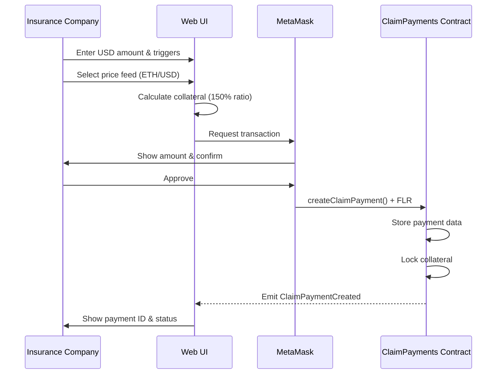
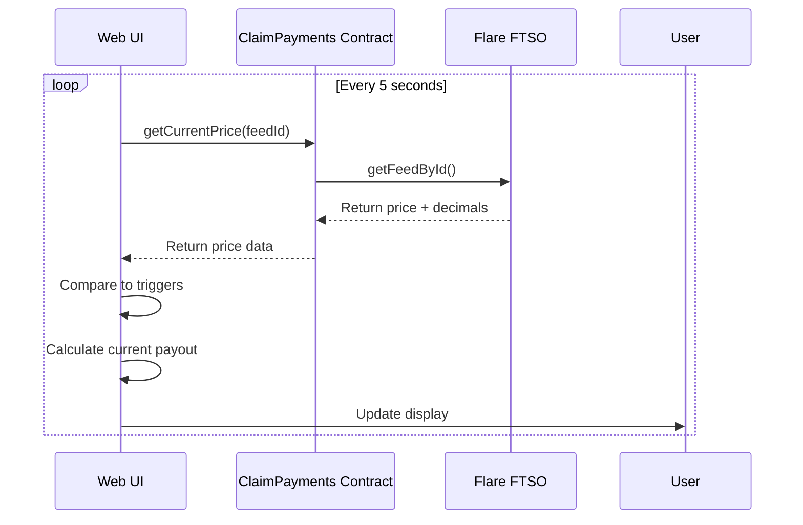
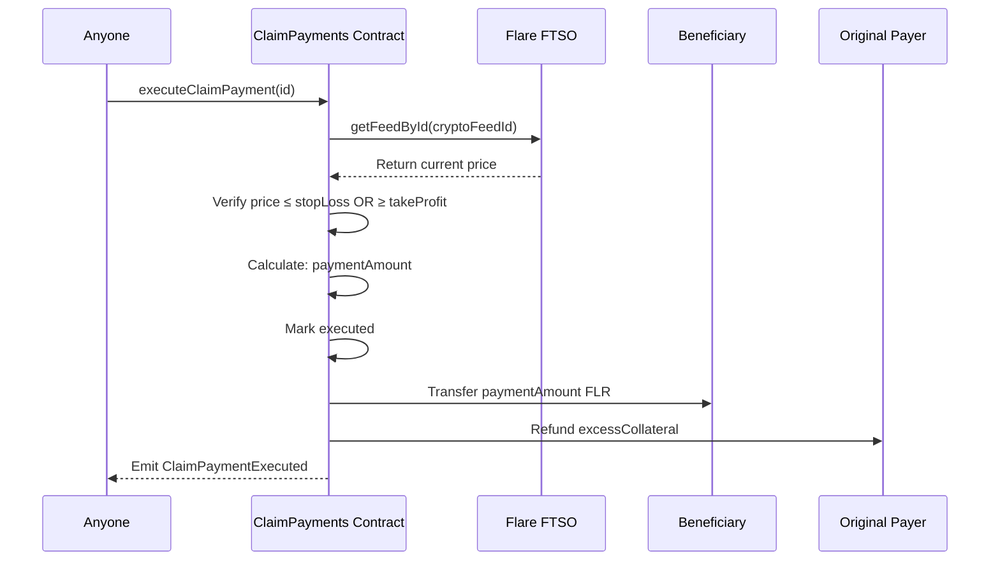

# How It Works

## Complete Payment Flow

### Overview

The ClaimPayments system optimizes crypto payments through three phases:
1. **Creation** - Define USD payment with price triggers and lock collateral
2. **Monitoring** - Track FTSO prices until trigger conditions met
3. **Execution** - Calculate and pay crypto amount when price optimal

### Important: Demo Mode on Coston2

The testnet demo calculates crypto amounts using chosen price feeds (ETH/USD, BTC/USD) but pays the same numeric value in FLR. This demonstrates the optimization concept using real FTSO prices without requiring expensive FLR collateral.

**Example:** 
- Input: $10 USD payment with ETH/USD feed
- FTSO price: ETH = $2,000
- Calculation: $10 ÷ $2,000 = 0.005 ETH-equivalent
- Payment: Send 0.005 FLR (not 0.005 ETH)

This shows real savings percentages using authentic market data.

---

## Phase 1: Payment Creation



**What Happens:**
1. User fills form with USD amount (e.g., $10)
2. User selects price feed (ETH/USD or BTC/USD)
3. User sets stop loss (e.g., -5%) and take profit (e.g., +5%)
4. UI calculates required collateral (150% of worst-case payout)
5. MetaMask prompts for transaction with collateral amount
6. User confirms and sends FLR to contract
7. Contract stores payment on-chain with pending status
8. Event emitted for UI tracking
9. Payment assigned unique ID

**Stored Data:**
- Payment ID (incremental)
- Payer address
- Receiver address  
- USD amount (in cents)
- Selected feed ID
- Stop loss price
- Take profit price
- Collateral amount (FLR)
- Expiry timestamp
- Status (pending)

---

## Phase 2: Monitoring



**What Happens:**
1. UI polls FTSO price every few seconds
2. Contract queries feed (e.g., ETH/USD)
3. FTSO returns current price with decimals
4. UI calculates: `cryptoAmount = (usdAmount × 10^18 × 10^decimals) / (price × 100)`
5. UI compares price to stop loss and take profit
6. UI displays status:
   - **Below Stop Loss** → Ready to execute (prevent further loss)
   - **In Range** → Pending (waiting for optimal price)
   - **At/Above Take Profit** → Ready to execute (maximum savings!)

**Demo Mode Display:**
- Shows calculation in selected crypto (ETH/BTC)
- Shows actual payment will be in FLR
- Shows potential savings vs stop loss scenario

---

## Phase 3: Execution



**What Happens:**
1. Anyone calls `executeClaimPayment(id)` (permissionless!)
2. Contract queries FTSO for current price
3. Contract verifies trigger hit: `price ≤ stopLoss OR price ≥ takeProfit`
4. Contract calculates: `paymentAmount = (usdAmount × 10^18 × 10^decimals) / (price × 100)`
5. Contract marks payment as executed
6. Contract transfers `paymentAmount` in FLR to receiver
7. Contract calculates: `excessCollateral = collateralAmount - paymentAmount`
8. Contract refunds `excessCollateral` to original payer
9. Event emitted with execution details

**Demo Mode Execution:**
- Queries chosen feed price (ETH/USD or BTC/USD)
- Calculates amount using that feed's price
- Sends calculated amount in FLR (native token)
- This demonstrates real savings using real FTSO data

## Detailed Function Breakdown

### 1. Creating a Payment

```solidity
function createClaimPayment(
    address _receiver,          // Who receives payment
    uint256 _usdAmount,         // USD in cents (e.g., 100000 = $1000)
    bytes21 _cryptoFeedId,      // FTSO feed ID
    uint256 _stopLossPrice,     // Lower price limit
    uint256 _takeProfitPrice,   // Upper price limit
    uint256 _expiryDays         // Days until expiry
) external payable returns (uint256 paymentId)
```

**Input Validation:**
- ✅ Receiver address must be valid (non-zero)
- ✅ USD amount must be positive
- ✅ Take profit must be greater than stop loss
- ✅ Must send collateral (msg.value > 0)
- ✅ Expiry days must be positive

**Storage:**
```solidity
ClaimPayment {
    id: 0,
    payer: msg.sender,           // Your wallet
    receiver: 0x123...,          // Beneficiary
    usdAmount: 100000,           // $1,000
    cryptoFeedId: BTC/USD,
    stopLossPrice: 6000000,      // $60,000
    takeProfitPrice: 7500000,    // $75,000
    collateralAmount: 0.03 FLR,
    createdAt: timestamp,
    expiresAt: timestamp + 30 days,
    executed: false
}
```

### 2. Executing a Payment

```solidity
function executeClaimPayment(uint256 _paymentId) external
```

**Execution Checks:**
1. ✅ Payment exists (`collateralAmount > 0`)
2. ✅ Not already executed (`executed == false`)
3. ✅ Not expired (`block.timestamp <= expiresAt`)
4. ✅ Price in range (`stopLoss ≤ price ≤ takeProfit`)
5. ✅ Sufficient collateral (`paymentAmount ≤ collateral`)

**Price Calculation:**
```javascript
// From FTSO
currentPrice = 7000000  // $70,000 with 2 decimals
decimals = 2

// Calculate crypto amount
paymentAmount = (usdAmount * 10^decimals) / currentPrice
paymentAmount = (100000 * 10^2) / 7000000
paymentAmount = 10000000 / 7000000
paymentAmount = 0.0143 BTC (in wei/smallest unit)
```

**State Updates:**
```solidity
payment.executed = true
payment.executedAt = block.timestamp
payment.executedPrice = 7000000
payment.paidAmount = 0.0143 BTC
```

**Transfers:**
1. Send `paidAmount` to receiver
2. Send `collateral - paidAmount` to payer

### 3. Cancelling a Payment

```solidity
function cancelClaimPayment(uint256 _paymentId) external
```

**Requirements:**
- ✅ Must be called by payer only
- ✅ Payment not executed yet
- ✅ Payment exists

**Action:**
- Returns full collateral to payer
- Sets `collateralAmount = 0`
- Emits `ClaimPaymentCancelled` event

## Price Range Logic

### Why Both Limits?

```
Scenario: BTC currently at $65,000

Without limits:
  - Price drops to $40,000 → Pay 0.025 BTC ❌ EXPENSIVE!
  - Price rises to $90,000 → Pay 0.011 BTC ✅ Great, but might never happen

With limits ($60k - $75k):
  - Stop Loss ($60k): "Execute if it drops here before I pay even more"
  - Take Profit ($75k): "Execute if it rises here for optimal rate"
  - Creates realistic execution window
```

### Execution Examples

```
Payment: $1,000 USD via BTC/USD
Stop Loss: $60,000
Take Profit: $75,000
Collateral: 0.03 BTC

Scenario 1: Price = $58,000
❌ Cannot execute (below stop loss)
If executed would pay: 0.0172 BTC

Scenario 2: Price = $65,000
✅ Can execute (in range)
Will pay: 0.0154 BTC
Refund: 0.0146 BTC

Scenario 3: Price = $72,000
✅ Can execute (in range) - OPTIMAL!
Will pay: 0.0139 BTC
Refund: 0.0161 BTC

Scenario 4: Price = $80,000
❌ Cannot execute (above take profit)
If executed would pay: 0.0125 BTC
```

## Event Emissions

### ClaimPaymentCreated
```solidity
event ClaimPaymentCreated(
    uint256 indexed paymentId,
    address indexed payer,
    address indexed receiver,
    uint256 usdAmount,
    bytes21 cryptoFeedId,
    uint256 stopLossPrice,
    uint256 takeProfitPrice,
    uint256 expiresAt
)
```

**Used for:**
- Building payment history in UI
- Filtering payments by user
- Real-time notifications

### ClaimPaymentExecuted
```solidity
event ClaimPaymentExecuted(
    uint256 indexed paymentId,
    address indexed executor,
    uint256 executedPrice,
    uint256 paidAmount,
    uint256 refundedAmount,
    uint256 timestamp
)
```

**Used for:**
- Tracking execution history
- Calculating actual cost savings
- Audit trail

### ClaimPaymentCancelled
```solidity
event ClaimPaymentCancelled(
    uint256 indexed paymentId,
    address indexed payer,
    uint256 refundedAmount
)
```

**Used for:**
- Tracking cancelled payments
- Verifying refunds

## Security Features

### Checks-Effects-Interactions Pattern
```solidity
// 1. CHECKS
require(!payment.executed, "Already executed");
require(currentPrice >= stopLoss, "Price too low");

// 2. EFFECTS (update state)
payment.executed = true;
payment.paidAmount = calculatedAmount;

// 3. INTERACTIONS (external calls)
receiver.transfer(paidAmount);
payer.transfer(excessCollateral);
```

### Reentrancy Protection
- State updated before external transfers
- No callbacks or external contract calls during execution

### Access Control
- Only payer can cancel their payment
- Anyone can execute (permissionless when conditions met)
- No admin privileges or upgradability

## Next Steps

- [Create your first payment via UI](./03-creating-payments-ui.md)
- [Query payment history](./04-querying-transactions.md)
- [Explore price feeds](./05-price-feeds-reference.md)
